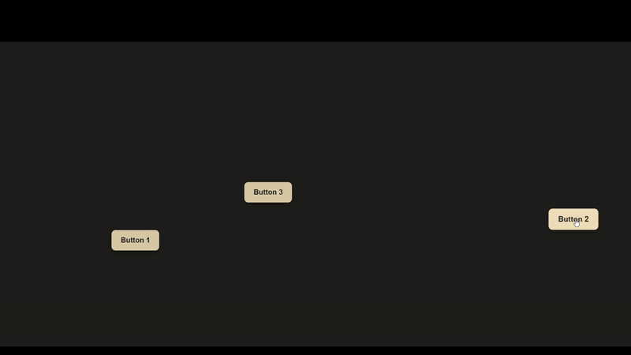

# ScreenBot
 
This ScreenBot detects images on your screen and performs mouse actions that look and feel human.  
The movement is not purely time‑based — it uses small, randomised offsets, varied speeds, and micro‑delays to simulate real human behavior when moving or clicking.  
The project was originally built for internal use but has been cleaned up for public release.

# ScreenBot
<p align="center">
  
</p>

---

## Installation

You will need Python 3.11 or newer.

1. Clone this repository:
   ```bash
   git clone https://github.com/Juuzoe/ScreenBot.git
   cd ScreenBot
   ```

2. (Optional but recommended) Create a virtual environment:
   ```bash
   python -m venv .venv
   .\.venv\Scripts\activate
   ```

3. Install dependencies:
   ```bash
   pip install -r requirements.txt
   ```

4. Run the program:
   ```bash
   python main.py
   ```

---

## Usage

The interface lets you choose a workflow YAML file and monitor activity logs.  
You can also control ScreenBot entirely through hotkeys:

- **Alt + Shift + S** – start the current workflow  
- **Alt + Shift + X** – stop the current workflow  

Workflows describe what the bot should look for and what to do when a match is found.

Example:
```yaml
steps:
  - name: "Click button"
    condition:
      template_path: assets/button.png
      confidence: 0.9
    action:
      type: click
```
(Find more commands in workflows/test.yaml)

ScreenBot reads each step, searches the screen for the given template, and performs the action when a match is detected.

---

## Folder Structure

```
core/          # detection logic and timing routines
ui/            # interface code
assets/        # template images (add your own here)
workflows/     # YAML scripts describing actions
requirements.txt
```

---

## Notes

- The bot was designed and tested on 1920x1080 displays.  
- Template images should be cropped around the visual element you want detected.  
- If you only want to simulate actions without clicking, set `dry_run: true` in the YAML file.

---

## License

This project is provided as-is under the MIT license.  
You are free to modify and use it for your own projects.
